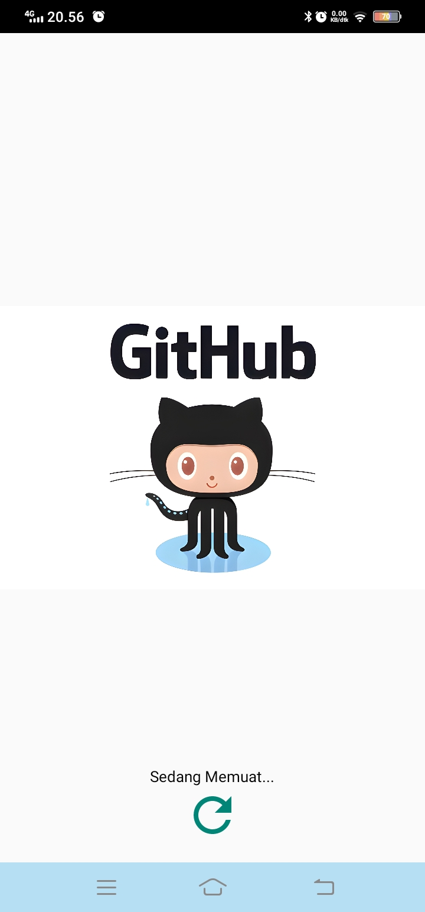
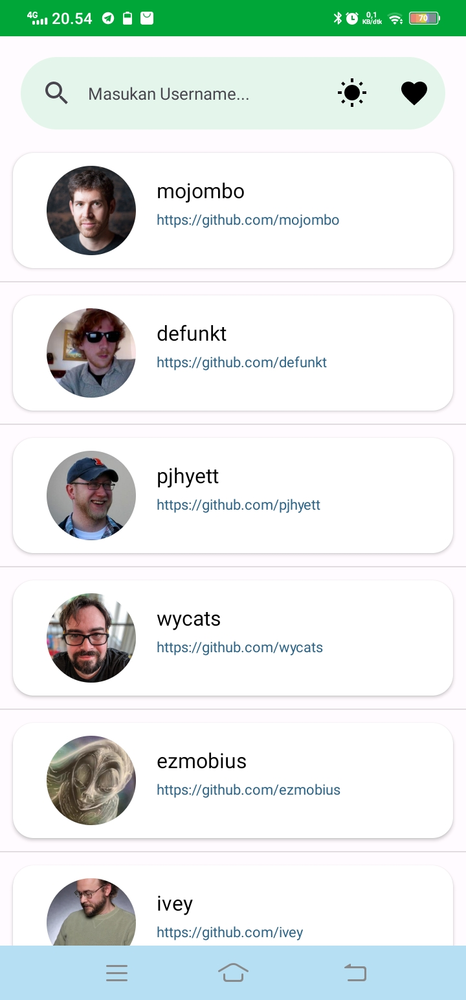
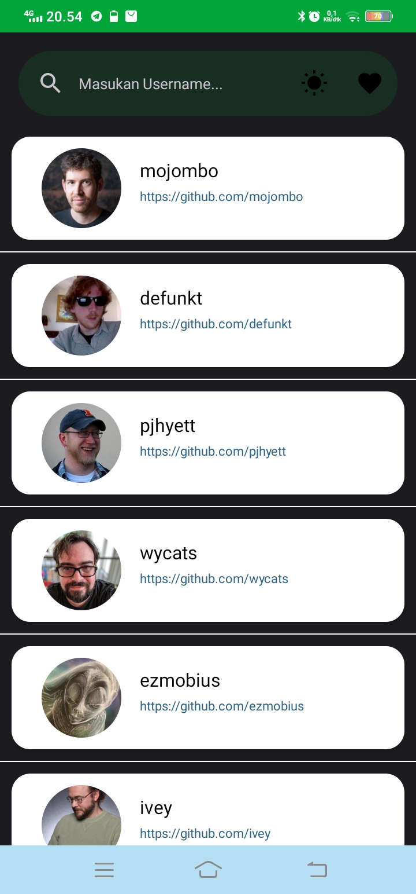
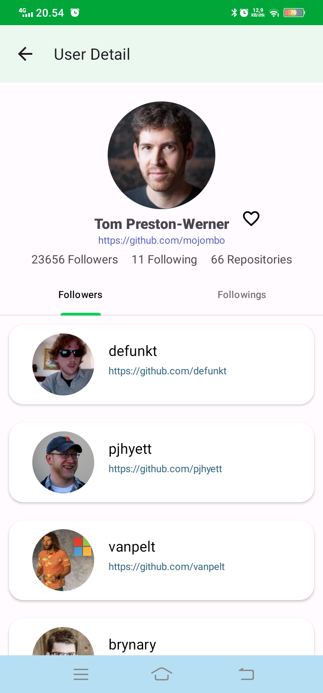
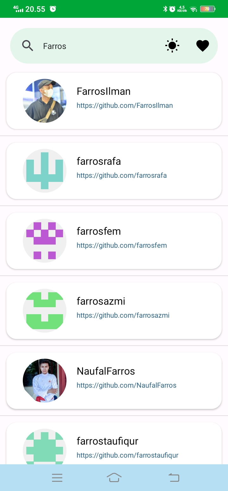
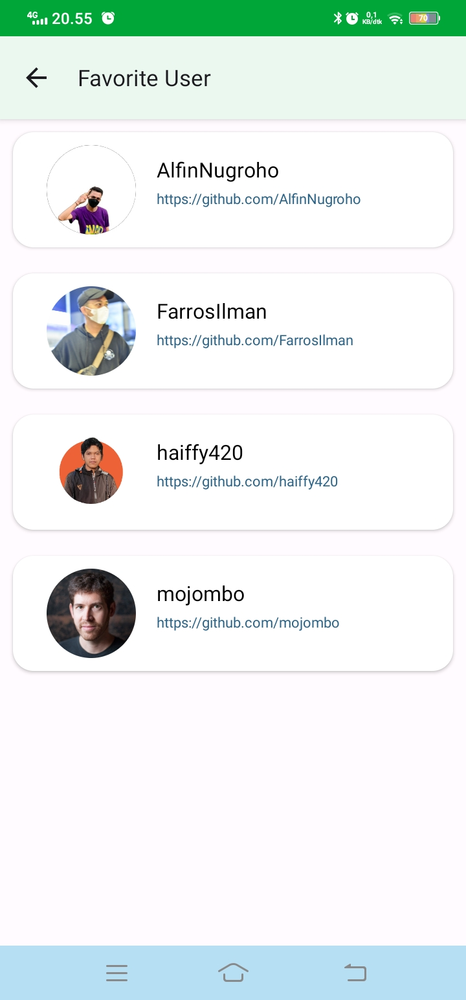
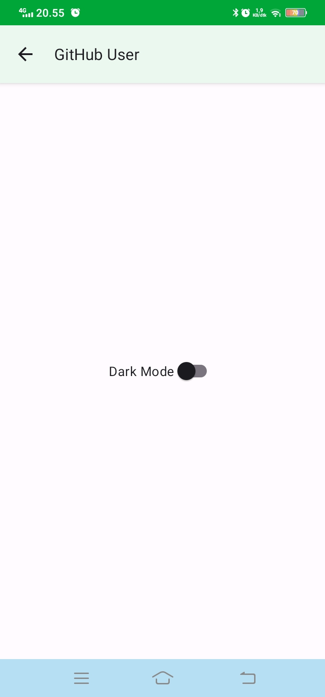

# GitHub User - Submission Android Fundamental

  

Proyek ini adalah bagian dari kursus Android Fundamental dalam program Bangkit 2023. Tujuannya adalah untuk mengembangkan aplikasi Android yang memungkinkan pengguna untuk mencari dan menampilkan informasi tentang pengguna GitHub. Aplikasi ini memanfaatkan API GitHub untuk mengambil data pengguna secara real-time.

## Fitur Utama
- **Pencarian Pengguna GitHub:** Pengguna dapat memasukkan nama pengguna GitHub dan mencari profil pengguna.
- **Tampilan Utama:** Menampilkan Search Bar guna untuk mencari pengguna GitHub dan Menampilkan list pengguna GitHub.
- **Tampilan Detail Pengguna:** Aplikasi menampilkan informasi lengkap tentang profil pengguna, termasuk nama, foto profil, pengikut, mengikuti, repositori yang dimiliki oleh pengguna, dan terdapat tombol favorite untuk menambahkan user tersebut ke favorite atau menghapusnya dari favorite.
- **Tampilan Favorite:** Menampilkan list pengguna yang ditambahkan ke favorite.
- **Menu Ganti Mode:** Terdapat menu untuk berganti Mode (Dark / Light).

## Teknologi yang Digunakan
- **Bahasa Pemrograman:** Kotlin
- **Pustaka Android:** Retrofit, RecyclerView, LiveData, ViewModel
- **Desain Antarmuka Pengguna:** XML Layouts, Material Design Components
- **Penanganan Permintaan Jaringan:** Retrofit

## Cara Menjalankan Aplikasi
1. Clone repositori ini ke perangkat Anda.
2. Buka proyek menggunakan Android Studio.
3. Sambungkan perangkat Android Anda atau gunakan emulator.
4. Jalankan proyek dengan mengklik tombol "Run".

## Tangkapan Layar Aplikasi

  
<b>Tampilan Utama dan Detai User</b>

  
  
  
  
<b>Tampilan Pencarian, Favorite, dan Mode Ganti</b>

  
  
  

## Kontribusi
Kami selalu menyambut kontribusi dari para pengembang. Jika Anda ingin berkontribusi pada proyek ini, silakan buat _Pull Request_ dan kami akan meninjau kontribusi Anda.

Terima kasih telah menjelajahi proyek GitHub User Finder kami. Semoga proyek ini bermanfaat dan menjadi inspirasi bagi Anda dalam pengembangan aplikasi Android Anda sendiri.
